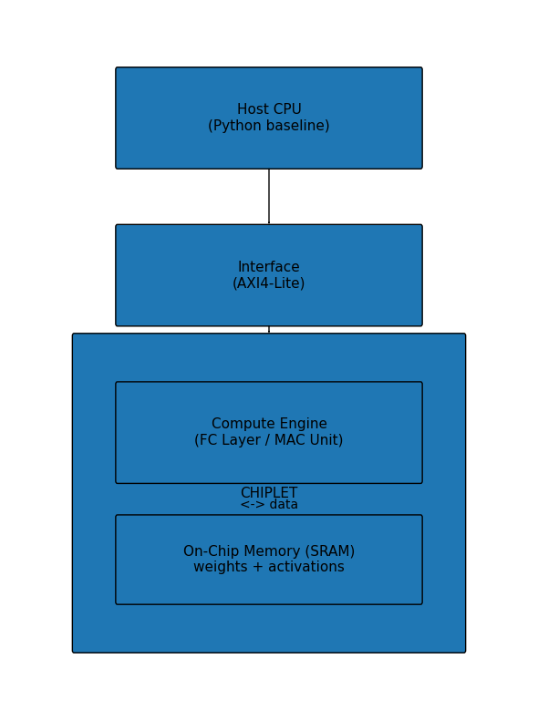

# ECE410 HW4 AI

## Author
Bao Nguyen

## Course
ECE 410/510 Spring 2026

## Description
This repository contains my ECE410/510 Codefest homework assignments using AI tools, plus the semester project.

---

## Repository Structure

```
codefest/
  cf01/                       Codefest 1 — workload accounting, ResNet-18 profiling
  cf02/                       Codefest 2 — roofline analysis, quantization profiling
  cf03/                       Codefest 3 — GEMM CUDA, DRAM traffic analysis
  cf04/                       Codefest 4 — Quantization, MAC HDL, LLM comparison

course-materials/             Weekly slides, docs, and notes (weeks 1–4)

project/                      K-Means image color quantization accelerator
  hdl/                        Synthesizable RTL distance core
  m1/                         Milestone 1: interface selection, SW baseline
  m2/                         Milestone 2: precision choice, behavioral RTL, AXI4-Lite slave
```

---

## Project: K-Means Image Color Quantization Accelerator



### Compute Core (`project/hdl/kmeans_dist_core.sv`)

Synthesizable K-Means squared-distance engine. For each input pixel, computes
the squared Euclidean distance to all K centroids and outputs the nearest centroid
label in a single clock cycle.

**Interface**

| Port | Width | Direction | Description |
|------|-------|-----------|-------------|
| `clk` | 1 | in | Clock |
| `rst_n` | 1 | in | Active-low synchronous reset |
| `start` | 1 | in | Pulse high for one cycle to begin |
| `pixel[d]` | 8 | in | Pixel channel d (0=R, 1=G, 2=B) |
| `centroids[k*D+d]` | 8 | in | Centroid k channel d (flat 1D, K×D elements) |
| `done` | 1 | out | High for one cycle when outputs are valid |
| `min_dist` | 20 | out | Minimum squared distance (integer) |
| `label` | 4 | out | Nearest centroid index (0..K-1) |

**Parameters:** K=16, D=3, DATA_W=8, DIST_W=20, LABEL_W=4

**Precision — integer arithmetic (zero quantization error)**

RGB values are integers in [0, 255]. Max squared distance over D=3 dimensions is 3×255²=195,075, which fits in 18 bits. INT8/INT16 would overflow (max diff² = 65,025 exceeds INT16 range). Integer 20-bit accumulators give exact results without vendor FP IP.

The M1 SW baseline measured ~1 FLOP/byte arithmetic intensity, placing the kernel firmly in the memory-bound regime. This justifies avoiding wider FP formats that would only increase memory traffic.

**UCIe interface justification**

Documented in `project/m1/interface_selection.md`. UCIe provides 51× more bandwidth than required for streaming 1080p at 30 fps, ensuring the compute core is never bandwidth-starved.

**Verified with cocotb 2.0.1**
- `test_kmeans_nearest`: black pixel (0,0,0) → centroid at origin, min_dist=0
- `test_kmeans_midpoint`: gray pixel (128,128,128) → centroid at (128,128,128), min_dist=0

### Milestones

| Milestone | Location | Status |
|-----------|----------|--------|
| M1: Interface selection + SW baseline | `project/m1/` | Done |
| M2: Precision choice + behavioral RTL + AXI4-Lite slave | `project/m2/` | Done |


