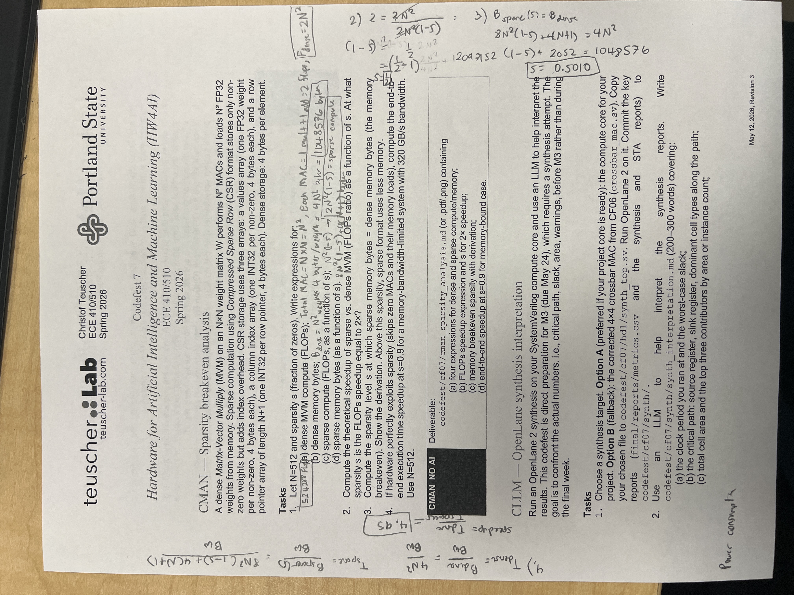

# CF07 CMAN — Sparsity Breakeven Analysis

**ECE 410/510 Spring 2026 — Bao Nguyen**

Dense MVM on an N×N FP32 weight matrix W performs N² MACs and loads N² weights from memory. CSR sparse storage uses:
- `values[]`: one FP32 per non-zero (4 bytes each)
- `col_idx[]`: one INT32 per non-zero (4 bytes each)
- `row_ptr[]`: length N+1, one INT32 per row pointer (4 bytes each)

With N = 512 and s = fraction of zeros.

---

## (a) Dense vs sparse compute/memory expressions

### Dense MVM compute
Each output element of y = W·x is one dot product of length N → N multiplies + N−1 adds ≈ **N MACs = 2N FLOPs**. For N output elements:

$$F_\text{dense} = 2N^2 \text{ FLOPs}$$

### Dense memory bytes
N² FP32 weights × 4 B each:

$$B_\text{dense} = 4N^2 \text{ bytes}$$

### Sparse MVM compute (function of s)
Skip every zero. Only (1 − s)·N² non-zeros remain; each contributes 1 MAC = 2 FLOPs:

$$F_\text{sparse}(s) = 2(1-s)N^2 \text{ FLOPs}$$

### Sparse memory bytes (CSR, function of s)
- `values`: 4·(1−s)·N²
- `col_idx`: 4·(1−s)·N²
- `row_ptr`: 4·(N+1)

$$B_\text{sparse}(s) = 8(1-s)N^2 + 4(N+1) \text{ bytes}$$

---

## (b) FLOPs speedup and the s for 2× speedup

$$\text{Speedup}_\text{FLOPs} = \frac{F_\text{dense}}{F_\text{sparse}(s)} = \frac{2N^2}{2(1-s)N^2} = \frac{1}{1-s}$$

For a 2× speedup:

$$\frac{1}{1-s} = 2 \implies 1-s = 0.5 \implies s = 0.5 \;(50\%)$$

**Intuition**: speedup tracks the fraction of work skipped. Cut half the work → 2×. Cut 90% → 10×. The FLOPs speedup is purely a function of sparsity, independent of N.

---

## (c) Memory breakeven sparsity

Setting B_sparse(s) = B_dense:

$$8(1-s)N^2 + 4(N+1) = 4N^2$$

Solving for s:

$$8(1-s)N^2 = 4N^2 - 4(N+1)$$

$$1 - s = \frac{4N^2 - 4(N+1)}{8N^2} = \frac{N^2 - N - 1}{2N^2}$$

$$s = 1 - \frac{N^2 - N - 1}{2N^2} = \frac{N^2 + N + 1}{2N^2}$$

For N = 512:
- N² = 262,144
- N² + N + 1 = 262,657
- 2N² = 524,288

$$s_\text{breakeven} = \frac{262657}{524288} \approx 0.5010 \;(50.10\%)$$

**Why ~50%?** CSR stores **2× the metadata per non-zero** (one INT32 col_idx for each FP32 value, so 8 B per NZ instead of 4 B). The row_ptr overhead of 4(N+1) ≈ 2 KB is negligible against the 1 MB dense matrix. So you must remove roughly half the elements before CSR's 2× per-element overhead is offset.

**Above** s = 50.10%, sparse format uses less memory. **Below** that, dense wins on memory.

---

## (d) End-to-end speedup at s = 0.9 (memory-bound, 320 GB/s)

In a memory-bandwidth-limited system, execution time = bytes loaded / bandwidth (HW perfectly exploits sparsity → both compute and memory loads scale with (1 − s)).

### Dense time
$$B_\text{dense} = 4N^2 = 4 \cdot 262144 = 1{,}048{,}576 \text{ bytes} \approx 1.00 \text{ MB}$$

$$T_\text{dense} = \frac{1048576}{320 \times 10^9} \approx 3.28 \text{ μs}$$

### Sparse time at s = 0.9
$$B_\text{sparse}(0.9) = 8(0.1)(262144) + 4(513) = 209715.2 + 2052 = 211767.2 \text{ bytes} \approx 207 \text{ KB}$$

$$T_\text{sparse} = \frac{211767.2}{320 \times 10^9} \approx 662 \text{ ns}$$

### End-to-end speedup
$$\text{Speedup} = \frac{T_\text{dense}}{T_\text{sparse}} = \frac{1048576}{211767.2} \approx 4.95\times$$

### Algebraic explanation of the 5× vs 10× gap

Since bandwidth cancels, the memory-bound speedup is **exactly**:

$$\frac{B_\text{dense}}{B_\text{sparse}(s)} = \frac{4N^2}{8(1-s)N^2 + 4(N+1)} \tag{exact}$$

For large N at high sparsity, the row_ptr overhead 4(N+1) becomes small compared to 8(1−s)N². Concretely at N=512, s=0.9: 2,052 B vs 209,715 B → row_ptr is <1% of total sparse bytes. **In this asymptotic regime**, we can approximate:

$$\frac{B_\text{dense}}{B_\text{sparse}(s)} \approx \frac{4N^2}{8(1-s)N^2} = \frac{1}{2(1-s)} \tag{large-N, high-s}$$

This is **not exact** — it's an asymptotic simplification valid when 4(N+1) ≪ 8(1−s)N², i.e., when (1−s)N ≫ 1/2 (large matrix and/or moderate-to-high sparsity). At low sparsity or small N, the row_ptr term must be retained.

Comparing the approximation to the FLOPs speedup 1/(1−s):

$$\text{Memory speedup} \approx \frac{1}{2(1-s)} = \frac{1}{2} \cdot \underbrace{\frac{1}{1-s}}_{\text{FLOPs speedup}}$$

**Why the per-element cost ratio appears in front of 1/(1−s).** Both speedups have the same structure: total dense work divided by sparse work that scales with (1−s) non-zeros. The only thing that changes between FLOPs and memory is the per-element cost.

| | Dense cost per element | Sparse cost per NZ | Cost ratio | Speedup |
|---|---|---|---|---|
| **FLOPs** | 2 FLOPs (one MAC) | 2 FLOPs (one MAC) | 2/2 = **1** | 1 · 1/(1−s) |
| **Memory** | 4 B (one FP32) | 8 B (FP32 + INT32 col_idx) | 4/8 = **1/2** | (1/2) · 1/(1−s) |

The (1−s) factor comes from the same place in both — fraction of cells you keep. The per-element cost ratio is the leading coefficient. **FLOPs has no penalty because a MAC is a MAC**: storing the matrix as sparse doesn't change the per-element compute cost. **Memory has a 1/2 penalty because every kept non-zero now carries an INT32 column index** alongside its FP32 value, doubling the per-element byte cost.

That same 4/8 = 1/2 factor is what puts the memory breakeven at s ≈ 1/2: you need to delete half the elements just to offset CSR's doubled cost per kept element.

At s = 0.9, N = 512: exact memory speedup = 4.95× (from the unsimplified formula above); asymptotic prediction = 5.00×; FLOPs speedup = 10×. The exact and approximate agree to within ~1% because the row_ptr term really is negligible at these parameters — but the **5× / 10× gap is the algebraic fingerprint of CSR's `col_idx` overhead**, visible directly in the denominator of the byte ratio.

**Lesson for the project**: for memory-bound K-Means in CSR-style storage, getting close to the ideal compute speedup requires either (1) structured sparsity that compresses the indexing, (2) very high sparsity where the row_ptr overhead amortizes well, or (3) bit-packing the indices.

---

## Summary

| Quantity | Expression | At N=512, s=0.9 |
|----------|-----------|----------------|
| Dense FLOPs | 2N² | 524,288 |
| Dense bytes | 4N² | 1.00 MB |
| Sparse FLOPs(s) | 2(1−s)N² | 52,429 |
| Sparse bytes(s) | 8(1−s)N² + 4(N+1) | 207 KB |
| FLOPs speedup | 1/(1−s) | 10× |
| FLOPs speedup = 2× at | s = 0.5 | — |
| Memory breakeven | s = (N² + N + 1)/(2N²) ≈ 0.501 | — |
| End-to-end (memory-bound, 320 GB/s, s=0.9) | B_dense / B_sparse | **4.95×** |

---

## Handwritten work

