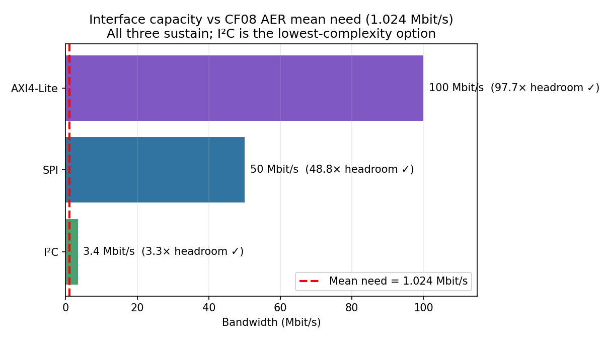
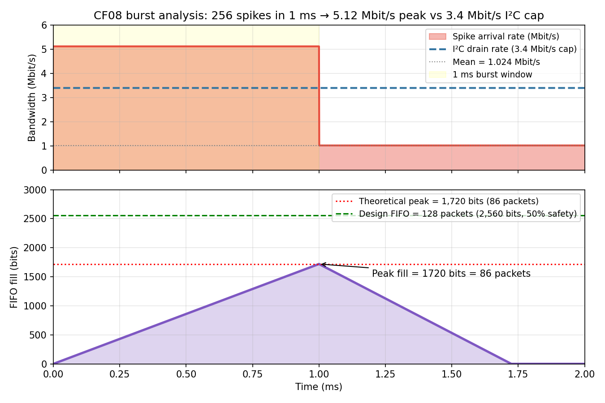
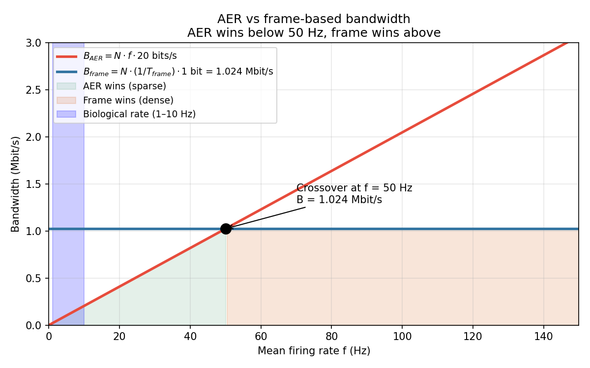

# CF08 CMAN — AER Bandwidth Analysis

**Bao Nguyen | ECE 410/510 Spring 2026**

**Given parameters (from the brief):**
- N = 1024 output neurons
- f = 50 Hz mean firing rate per neuron
- Packet = 10-bit address + 6-bit timestamp + 4-bit framing/parity = 20 bits total
- Firing is Poisson-like, independent across neurons

**Data-flow picture (whole problem at a glance):**

```
   1024 neurons          51,200 spikes/s         1.024 Mbit/s
   ┌──────────┐  spike   ┌──────────────┐  20b   ┌──────────┐
   │ neuron 0 │ ───────► │              │ ─────► │          │
   │ neuron 1 │ ───────► │  AER encoder │ ─────► │ off-chip │
   │   ...    │ ───────► │ (addr+ts+pty)│ ─────► │   bus    │
   │neuron1023│ ───────► │              │ ─────► │          │
   └──────────┘          └──────────────┘        └──────────┘
       each fires            packs each            output to
       at f = 50 Hz          spike into            host (SPI,
                             20-bit packet         I²C, AXI4-Lite)
```

---

## 1. Mean aggregate spike rate R

**Reasoning.** Each neuron fires at f = 50 spikes/s. There are N = 1024 neurons firing independently. By linearity of expectation (Poisson processes add), the aggregate spike rate is just the sum of the per-neuron rates.

**Formula:**

R = N × f

**Substituting:**

Step 1. Plug in N and f.
R = 1024 × 50

Step 2. Multiply.
R = **51,200 spikes/second**

---

## 2. Mean AER bandwidth B

**Reasoning.** Every spike produces one AER packet. Each packet is 20 bits (10 address + 6 timestamp + 4 framing/parity). So the bit rate is (spikes/s) × (bits/packet).

**Formula:**

B = R × 20 bits/packet

**Substituting:**

Step 1. Plug in R = 51,200 spikes/s.
B = 51,200 × 20

Step 2. Multiply.
B = 1,024,000 bits/second

Step 3. Convert bits/s → Mbit/s (divide by 10⁶).
B = 1,024,000 / 1,000,000 = **1.024 Mbit/s**

**Packet layout (20 bits = 2.5 bytes):**

```
   bit:  19          10  9        4  3      0
        ┌─────────────┬────────────┬────────┐
        │  ADDR (10b) │  TS (6b)   │ PTY 4b │
        └─────────────┴────────────┴────────┘
         which neuron    when         framing/
         (0..1023)       (mod 64)     parity
```

---

## 3. Interface comparison

Compute the **headroom** (interface max / required B) for each candidate. If the ratio is ≥ 1, the interface sustains the mean rate.

| Interface | Max bandwidth | Headroom = max / 1.024 | Can sustain? | Notes |
|-----------|---------------|------------------------|--------------|-------|
| I²C       | ≤ 3.4 Mbit/s  | 3.4 / 1.024 = 3.32×    | **YES**      | 2-wire bus, lowest complexity |
| SPI       | ≤ 50 Mbit/s   | 50 / 1.024 = 48.83×    | **YES**      | 4-wire, full-duplex |
| AXI4-Lite | ~100 Mbit/s   | 100 / 1.024 = 97.66×   | **YES**      | Bus-fabric, highest complexity |

**Visual (generated by `src/make_plots.py`):**



**Lowest-complexity interface that suffices: SPI.**

I²C sustains the mean (3.3× headroom) but cannot absorb the Task-4 burst at line rate without bolting on a 128-packet FIFO + controller, which adds more complexity than it saves. SPI bare runs at 50 Mbit/s, **9.8× over the burst peak** of 5.12 Mbit/s, and needs zero buffering. So "suffices" must cover both mean and burst behavior, and SPI is the lower-complexity choice end-to-end.

---

## 4. Burst analysis

**Burst spec:** stimulus arrives that causes 25% of the 1024 neurons to fire within a 1 ms window.

### 4a. Spikes in the burst window

Step 1. Compute fraction firing.
0.25 × 1024 = 256 neurons

Step 2. Each fires once in the window (worst-case synchronous burst).
n_burst = **256 spikes** in 1 ms

### 4b. Peak instantaneous bandwidth

Step 1. Compute total bits in the burst.
bits_burst = n_burst × 20 bits/packet = 256 × 20 = 5,120 bits

Step 2. Divide by the 1 ms window.
B_peak = 5,120 bits / 1 ms = 5,120 bits / 0.001 s = 5,120,000 bits/s

Step 3. Convert to Mbit/s.
B_peak = **5.12 Mbit/s**

### 4c. Burst-to-mean ratio

B_peak / B_mean = 5.12 Mbit/s / 1.024 Mbit/s = **5.0×**

**What this 5× tells me about SNN burstiness:**

If firing were purely independent Poisson at f = 50 Hz across all 1024 neurons, the 1 ms-window variance would scale as √(mean spikes/window). Mean spikes per 1 ms window = 1024 × 50 × 0.001 = **51.2 spikes**, so a 1-σ Poisson fluctuation is √51.2 ≈ **7 spikes**, about **14%** above mean. Hitting 256 spikes in a 1 ms window (5× the mean) is **~29 σ above** the Poisson expectation — astronomically unlikely under independent firing.

So a 5× burst-to-mean ratio is the signature of **synchronized, stimulus-locked activity**, not Poisson noise. In an SNN this happens when a stimulus onset drives a large fraction of the input layer to spike at nearly the same time (visual saccade, auditory transient, sensor event, etc.). The neurons are *correlated*, not independent. This is the case the brief is modeling.

**Design implication**: I have to provision the interface for the **peak**, not the average. Mean-rate sizing (1.024 Mbit/s) gets you an I²C that crashes during the first stimulus burst. Peak-rate sizing (5.12 Mbit/s + safety margin) is what makes the system actually usable. That is exactly why the lowest-complexity interface that **suffices** is SPI, not I²C — the burst behavior is what the design has to survive, and that's the constraint dictating the interface choice.

### 4d. Can the chosen interface (SPI) absorb the burst?

**Yes, with massive headroom.** SPI cap is 50 Mbit/s. The burst demands 5.12 Mbit/s, so:

50 Mbit/s / 5.12 Mbit/s = **9.8× headroom over the burst peak**

No FIFO required. The interface drains every spike at line rate as it arrives. Buffering is not needed because SPI can sink the burst rate ~10× faster than spikes can generate it.

### 4e. Counter-factual: what if we had picked I²C?

The reason I came back and switched the Task-3 answer to SPI is the math below. I²C's 3.4 Mbit/s line rate sits **below** the 5.12 Mbit/s burst, so it can't drain the burst in real time and would need buffering:

Step 1. Bits arriving during the burst.
arrive = B_peak × 1 ms = 5.12 × 10⁶ × 10⁻³ = 5,120 bits

Step 2. Bits draining during the burst at I²C line rate.
drain = B_I²C × 1 ms = 3.4 × 10⁶ × 10⁻³ = 3,400 bits

Step 3. Backlog = arriving minus draining.
backlog = 5,120 − 3,400 = **1,720 bits = 86 packets**

Step 4. Round up for safety margin → **FIFO depth ≥ 128 packets** (next power of 2).

That's 2,560 bits of on-chip SRAM + a FIFO controller + overflow management. Two "free" wires turn into a ~2.5 kbit RAM block plus state machine, which is the opposite of low complexity. **SPI wins on total system complexity, not just pin count.**

### 4f. Timing diagram (1 ms burst, hypothetical I²C path)

**Visual (generated by `src/make_plots.py`):**



Top panel: spike arrival jumps to 5.12 Mbit/s for 1 ms, but I²C only drains at 3.4 Mbit/s. The gap is overflow.

Bottom panel: FIFO fills linearly to **1,720 bits (86 packets)** at the end of the burst window, then drains back to zero over the next ~0.72 ms once arrivals drop back to the 1.024 Mbit/s mean. The **128-packet design FIFO** (2,560 bits, green dashed) sits 50% above the peak so back-to-back bursts don't overflow.

This diagram is what justifies picking SPI in the first place — under SPI the FIFO trace is flat at zero.

---

## 5. Frame-based comparison

**Frame readout spec:** sample all N neurons every T_frame = 1 ms, 1 bit per neuron per sample.

### 5a. Frame-based bandwidth

Step 1. Frames per second.
1 / T_frame = 1 / 0.001 s = 1000 frames/s

Step 2. Bits per frame = N (one bit per neuron).
bits/frame = 1024

Step 3. Frame bandwidth.
B_frame = 1024 × 1000 × 1 = 1,024,000 bits/s = **1.024 Mbit/s**

### 5b. AER-to-frame ratio at f = 50 Hz

B_AER / B_frame = 1.024 / 1.024 = **1.0×** (exactly tied at f = 50 Hz)

### 5c. Crossover firing rate f_crossover

Set the two bandwidths equal and solve for f.

Step 1. Write both bandwidths as functions of f.
B_AER(f) = N × f × 20 bits/s
B_frame  = N × (1 / T_frame) × 1 bit = N × 1000 bits/s (using T_frame = 1 ms)

Step 2. Set them equal.
N × f × 20 = N × 1000

Step 3. Cancel N from both sides.
20 × f = 1000

Step 4. Solve for f.
f = 1000 / 20 = **50 Hz**

So **f_crossover = 50 Hz**.

### 5d. Crossover plot (B vs firing rate f)

**Visual (generated by `src/make_plots.py`):**



Red line is AER bandwidth, scales linearly with f. Blue line is frame-based, flat at 1.024 Mbit/s. They cross at **f = 50 Hz** (black dot). Green region (left of crossover) is where AER wins, orange region (right) is where frame wins.

The biological-rate regime (1 to 10 Hz, purple band) sits way left of the crossover, so AER's bandwidth is **5× to 50× lower** than frame for that range. That's the regime neuromorphic chips are actually designed for.

### 5e. One-sentence implication

AER beats frame-based readout only when the mean firing rate is below 50 Hz, so AER is the right choice for sparse-firing SNNs (typical biological rates are 1 to 10 Hz, well below the crossover), but a frame-based bus becomes more bandwidth-efficient for dense or high-activity networks above 50 Hz.

---

## Summary table (all 5 tasks at a glance)

| # | Quantity                       | Formula                              | Value         |
|---|--------------------------------|--------------------------------------|---------------|
| 1 | Mean aggregate spike rate R    | N × f                                | 51,200 spikes/s |
| 2 | Mean AER bandwidth B           | R × 20 bits                          | **1.024 Mbit/s** |
| 3 | Lowest-complexity interface    | sustain mean AND burst, no FIFO      | **SPI** (9.8× burst headroom, no buffer needed; I²C would force a FIFO) |
| 4 | Burst peak bandwidth           | 256 spikes × 20 bits / 1 ms          | 5.12 Mbit/s (5.0× mean) |
| 4 | Burst-to-mean ratio            | B_peak / B_mean                      | **5.0×** (~29σ above Poisson → synchronized bursts) |
| 4 | FIFO depth if forced to I²C    | (B_peak − B_I²C) × 1 ms / 20 bits    | 86 packets → 128 for safety (counter-factual; SPI needs none) |
| 5 | Frame-based bandwidth          | N × (1/T_frame) × 1 bit              | 1.024 Mbit/s |
| 5 | Crossover firing rate          | 20·f = 1/T_frame → f = 50 Hz         | **f_crossover = 50 Hz** |

---

## Handwritten work

The full on-paper derivation of all five tasks is in [`cf08_handwritten.pdf`](cf08_handwritten.pdf). The typed sections above match that handwritten work step-for-step and add rendered plots from `src/make_plots.py`.
