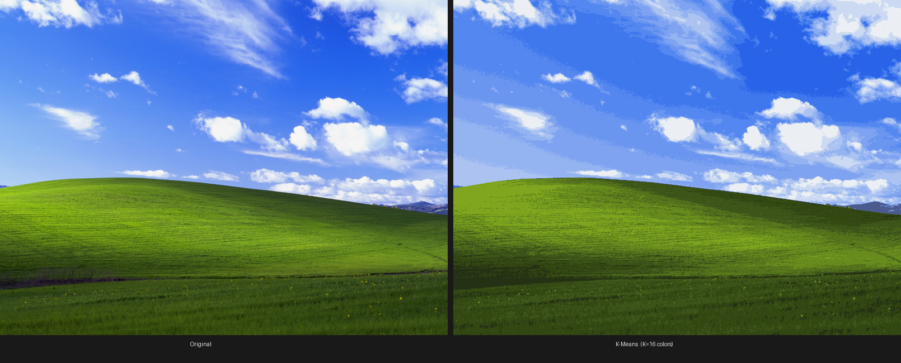
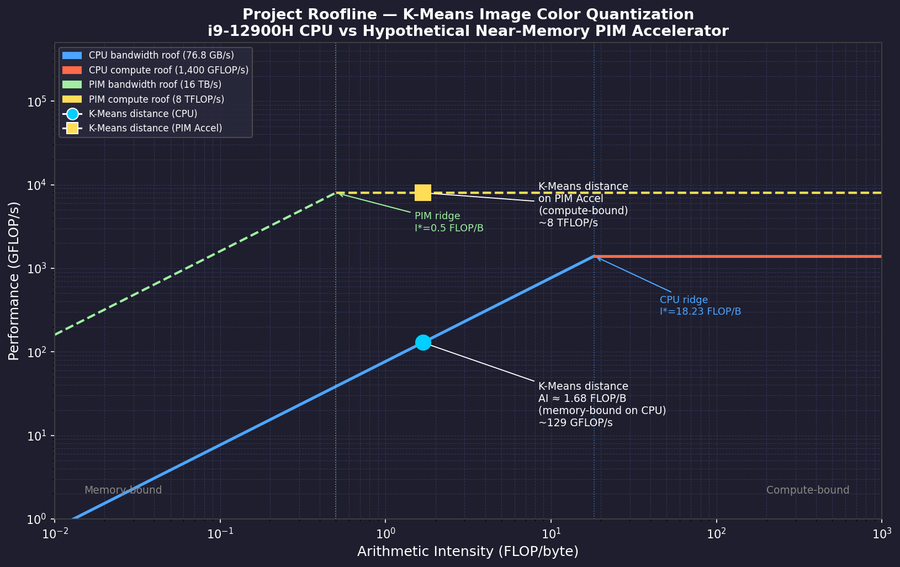
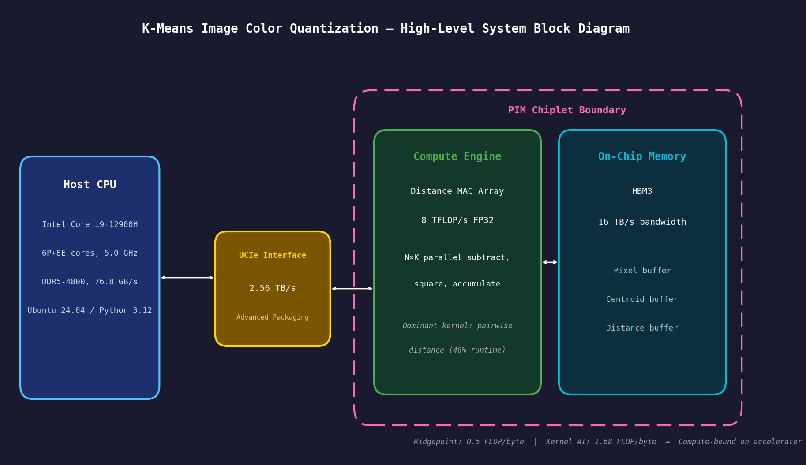

# Codefest Presentation — K-Means Image Color Quantization Accelerator
Bao Nguyen | ECE 410/510 | Spring 2026

---

## What am I doing?
- Custom chip that reduces any photo to 16 colors by grouping similar pixels

## How is it done today?
- Runs on CPU — ~9 sec/image, using less than 1% of CPU computing power
- Bottleneck is memory: CPU spends most of its time waiting for data, not doing math (46% of runtime)

## What am I doing differently?
- Memory and math units sit right next to each other — no waiting (near-memory PIM chiplet)
- 16 TB/s internal bandwidth vs CPU → **~62× projected speedup**

## What have I accomplished so far?
- Benchmarked CPU baseline and confirmed memory is the bottleneck
- Wrote and tested all hardware in simulation — distance engine, AXI4-Lite interface, and compute core — all passing testbenches

## What's next?
- Top-level integration: host driver ↔ UCIe ↔ AXI4-Lite slave ↔ integer distance core
- System-level functional verification with cocotb / SystemVerilog testbench
- Performance benchmarking vs. 9s CPU baseline (latency, throughput, 62× speedup validation)
- RTL synthesis & resource/timing reports (area, critical path, memory bandwidth utilization)

---

## Bliss — Before vs After K-Means (K=16 colors)

---

## Roofline — CPU vs PIM Accelerator

---

## System Architecture

