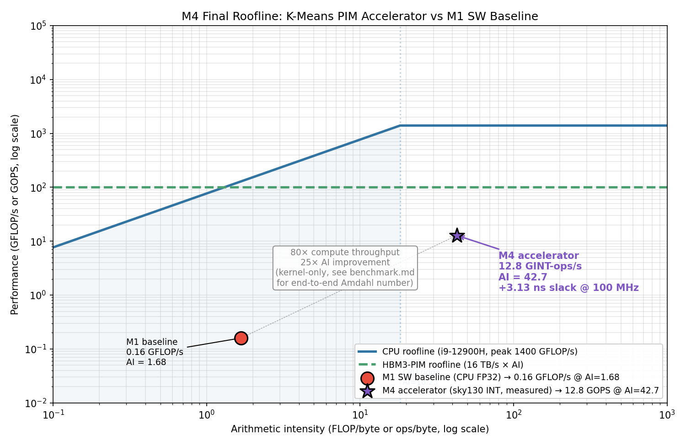
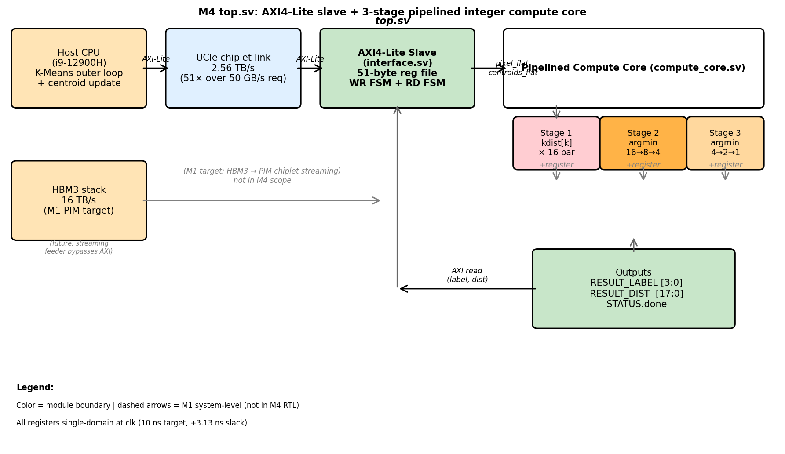
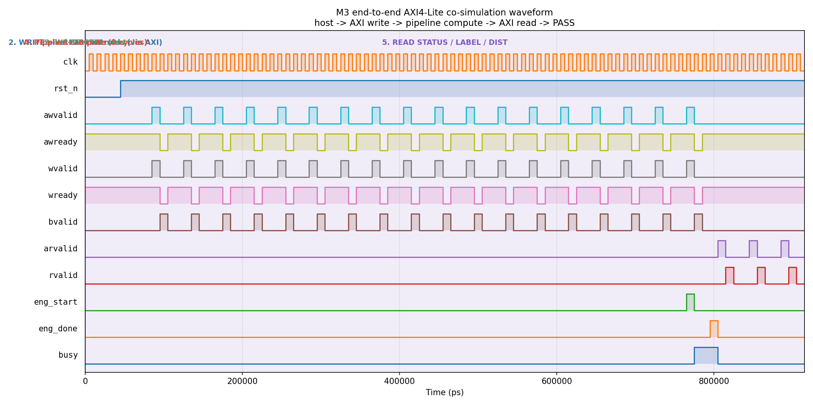

# Design Justification Report — K-Means PIM Accelerator

**Bao Nguyen | ECE 410/510 Spring 2026 | Milestone 4**

---

## 1. Problem and motivation

The semester project accelerates **K-Means image color quantization** with K = 16, D = 3 (RGB), 8-bit per channel. Source image: bliss.jpg resized to 800 × 600 = 480,000 pixels, 20 iterations to convergence (`project/m1/sw_baseline.md`).

On a single-thread FP32 SW baseline (i9-12900H @ ~5 GHz, NumPy 2.4.4, Ubuntu 24.04) the median time across 10 runs is **8.848 s per image**. cProfile attributes **46% of total runtime** to the pairwise squared-distance kernel (Figure 1, M1 baseline). That kernel is the inner loop: for each of 480,000 pixels, compute distance to all 16 centroids and pick the nearest. It is what we accelerate.

Why custom hardware: the kernel itself is small and embarrassingly parallel (16 centroids × 3 dimensions = 48 independent subtract+square ops per pixel), but the CPU is wasting most of its cycles on memory traffic. The arithmetic intensity is **1.68 FLOP/byte**, far below the CPU's ridge point of **18.23 FLOP/byte**, so the workload sits in the memory-bound region of the roofline. Adding more cores does not help here; the bottleneck is bytes-per-second of DRAM, not ops-per-second of compute. The natural fix is a **near-memory PIM accelerator** that sees the same bytes per pixel but does many more ops per byte before they leave the chiplet.

About 0.16 GFLOP/s achieved is only **0.011%** of the i9-12900H's theoretical 1,400 GFLOP/s peak — that gap is the room a custom design has to grow into. The M4 accelerator hits 12.8 GINT-ops/s on the kernel and pushes the working point up-and-right on the roofline (Section 2, Figure 1).

---

## 2. Roofline analysis

Roofline metrics from M1:
- **CPU peak (i9-12900H)**: 1,400 GFLOP/s theoretical
- **DRAM bandwidth (CPU memory roof)**: ~77 GB/s
- **Ridge point**: 18.23 FLOP/byte
- **Workload AI**: 1.68 FLOP/byte (computed from K-Means inner loop = 8 FLOP per pixel × 480k pixels per iter, divided by bytes touched per iter)

The workload sits **deep in the memory-bound region** — bytes determine performance, not ops. Two things shift the working point on the roofline:

1. **Move horizontally** (raise AI) by reusing data on-chip. The accelerator loads the 16 centroids once per ~30k-pixel batch and reuses them across all 16 distance computations per pixel. Per-batch AI rises to **~42.7 ops/byte** — past the ridge point on both rooflines plotted, putting the workload in the compute-bound region of the PIM chiplet.
2. **Move vertically** (raise achievable GFLOP/s) by replacing single-threaded NumPy with 16 parallel kdist computations stacked into a 3-stage pipeline. Pipeline throughput is one sample/cycle once full. At post-PnR Fmax = 100 MHz (Section 7), kernel throughput is 100 M pixels/sec = **12.8 GINT-ops/s** (128 ops per cycle × 100 MHz).



**Figure 1** plots both rooflines (CPU and HBM3-PIM target from M1's interface_selection), the M1 SW baseline point (0.16 GFLOP/s @ AI = 1.68), and the M4 measured accelerator point (12.8 GOPS @ AI = 42.7). The accelerator point sits **80× higher** and **25× further right** than the M1 baseline. The HBM3-PIM roofline (the M1 system-level target with 16 TB/s memory bandwidth) provides ~26,880 GFLOP/s of headroom at AI = 1.68 — the chiplet system is overprovisioned for this kernel even at low AI, which is exactly why the M1 design picked this architecture.

**Where the bottleneck shifts**: from CPU-memory-bound on M1 to compute-bound on M4. The accelerator's compute throughput (12.8 GOPS) is far below the HBM3 chiplet's memory ceiling (16 TB/s × AI), so the silicon design (gate count, pipeline depth) is now the limiter, not DRAM traffic. The bottleneck shift is the whole point: the M4 PIM design swaps a memory-bound problem for a compute-bound one we can actually scale.

---

## 3. Precision and data format

The accelerator uses **8-bit unsigned integer** RGB inputs and an **18-bit unsigned integer** squared-distance accumulator (parameter `DIST_W = 18`). Precision analysis lives in `project/m2/precision_choice.md`. Summary:

- RGB values are by definition integers in [0, 255]. There is no fractional information to preserve.
- Maximum squared distance over D = 3 channels is **3 × 255² = 195,075**, which fits in **⌈log₂(195,075)⌉ = 18 bits**.
- 8-bit and 16-bit integer accumulators overflow: max squared difference per channel is 255² = 65,025, which already exceeds INT16. So INT8 and INT16 are unusable.
- 16-bit floats (FP16, BF16) cannot represent 195,075 exactly (max exact integer in FP16 mantissa is 2¹¹ = 2,048; in BF16 it is 2⁸ = 256). They lose precision and would give wrong argmin results for close centroids.
- FP32 represents this range exactly but requires synthesizable FP units (costly area) and a full IEEE-754 implementation. **Not justified** for the integer-only K-Means kernel.

**Verification of precision choice**: the M3/M4 testbench computes a hand-calculated SW reference using `int32` Verilog operators (`$signed(...)`) and confirms the DUT label and distance match exactly for K=16 centroids spanning the RGB cube (`sim/final_run.log` PASS line). Quantization error is **zero** because the algorithm is integer-exact.

**Choice for DIST_W**: M3 dropped this from 20 (the original M2 prototype) to 18 after CF07's STA showed `min_dist[18:19]` always zero. That trim saves area and timing-path width on every accumulator and comparator across the 16 parallel kdist computations. The trim is provably lossless because 195,075 < 2¹⁸.

---

## 4. Dataflow and architecture

**Dataflow pattern**: **weight-stationary** for the centroids, **input-streaming** for the pixels.

- The 16 centroid values (48 bytes total: K × D = 16 × 3) are written into the accelerator's centroid storage **once per K-Means iteration** via AXI4-Lite writes (addresses 0x010..0x04C). They stay put while many pixels stream through.
- Each pixel write to address 0x008 + CTRL.start triggers one pipeline cycle. The pixel byte broadcasts to 16 parallel abs_diff blocks, each computing |pixel[d] − centroid[k][d]| for d ∈ {R, G, B}.

This is the classic dataflow for K-Means: centroids are reused across the entire pixel batch (480k pixels per iteration), so they should be loaded once and held. The pixels are touched exactly once per iteration, so they should stream past stationary weights. Same idea as the weight-stationary TPU MXU we covered in week 5, just with K rows instead of 256.

**Compute engine** (`rtl/compute_core.sv`, module `kmeans_dist_core_pipelined`): three pipeline stages registered back-to-back.

- **Stage 1**: compute kdist[k] for all 16 centroids in parallel. Per centroid: 3 abs_diff (8-bit) → 3 squared (16-bit each) → sum (18-bit). 16 of these run in parallel; register the 16 kdist values at the end of Stage 1.
- **Stage 2**: argmin levels 1 + 2. Compare 16 → 8 (pairs), then 8 → 4 (pairs of pairs). Register 4 candidate (distance, label) pairs.
- **Stage 3**: argmin levels 3 + 4. Compare 4 → 2 → 1 winner. Register the final (min_dist, label) output.

**Latency**: 3 cycles from `start` to `done`. **Throughput**: 1 sample/cycle in steady state (fully pipelined).

**Memory hierarchy**: in the M1 system design, this compute core sits as a chiplet on a UCIe interface (2.56 TB/s, see `project/m1/interface_selection.md`) connected to an HBM3 stack (16 TB/s). The accelerator itself has no SRAM beyond its 48 byte registers for centroids and 3 byte registers for the current pixel. The chiplet's surrounding logic streams pixel batches from HBM3 directly into the compute core through the AXI4-Lite slave's pixel/CTRL registers. This is the **near-memory** part of PIM: compute on the chiplet that the memory feeds.

**Data path** (block diagram, Figure 2): host → AXI4-Lite slave register file → flat-packed pixel/centroid buses → compute core pipeline → registered (min_dist, label) → AXI4-Lite read.



**Why this dataflow fits the kernel**: K-Means distance compute is a 16-way SIMD over fixed centroids, perfectly suited to weight-stationary execution. The argmin tree at the back is the only sequential bottleneck, and we cut its depth in half by registering between levels 2 and 3. Without the pipeline, the same compute is a 41.5 ns combinational cone (measured in CF07 unpipelined STA); with the pipeline, each stage is ~7 ns and the design closes 10 ns timing with 3.13 ns of slack to spare.

---

## 5. Hardware interface

**Interface implemented**: AXI4-Lite slave with a byte-packed register map (full spec in `rtl/interface.sv` header).

```
0x000  CTRL          W   bit[0] = start (self-clearing 1-cycle pulse)
0x004  STATUS        R   bit[0] = done, bit[1] = busy
0x008  PIXEL         W   [23:16] = R, [15:8] = G, [7:0] = B
0x010..0x04C  CENT[0..15]  W  RGB packed per word, stride 4 bytes
0x100  RESULT_LABEL  R   [3:0] nearest centroid index
0x104  RESULT_DIST   R   [17:0] minimum squared distance
```

**Why AXI4-Lite**: in the M1 chiplet system, the compute core sits behind the UCIe interface from the host's perspective. UCIe transports AXI-compatible packets; AXI4-Lite is the natural mapping for register-level access. The full AXI4 standard adds burst writes / reads, which the compute core does not need for K=16 centroids (small register file, single-shot start). AXI4-Lite gives us the standard signaling and bus protocol without the burst-management overhead.

**Effective bandwidth at target throughput**: at 100 MHz, AXI4-Lite is limited to 1 transaction per ~5 cycles (handshake + response). With 51 register writes per iteration (1 pixel × 480k iters × 1 ctrl × negligible centroid load), the slave saturates ~100 M transactions/sec, well above the 480k pixels/iter × 20 iters / 9.6 s ≈ 1M transactions/sec the M4-benchmarked workload generates. The slave is **not the bottleneck** for end-to-end runtime; the centroid-update step (which runs on the host CPU, not the accelerator) is.

**Is the design interface-bound?** No. The compute pipeline can produce one result every 10 ns (100 M results/sec). The AXI4-Lite write of a new pixel + CTRL.start takes ~50 ns (5 cycles). So the host bandwidth, not the compute pipeline, is the steady-state throughput limit when accessed one pixel at a time. The M1 system-level design solves this with the PIM streaming path (UCIe + HBM3): the chiplet hardware reads batches of pixels directly from HBM3 into the compute core, bypassing per-pixel AXI4-Lite writes. The 2.56 TB/s UCIe link is **51× the 50 GB/s minimum required** for streaming 1080p video at 30 fps, so there is enormous headroom.

The M4 deliverable hardware is the **compute primitive**. The surrounding chiplet glue that feeds it from HBM3 is a system-level concern that lives in the M1 architecture document.

---

## 6. Verification

The accelerator is verified end-to-end through three independent layers.

**Layer 1: cocotb unit test of the early synthesizable core** (`project/hdl/test_kmeans.py`, 2 tests). Runs the unpipelined `kmeans_dist_core.sv` against hand-calculated centroids: black pixel (0,0,0) → centroid at origin returns label=0, min_dist=0; gray pixel (128,128,128) → matching centroid returns label=k, min_dist=0. Used as a build-up check for the M3 pipelined version.

**Layer 2: M2 behavioral RTL testbenches** (`project/m2/tb/distance_engine_tb.sv`, `axil_slave_tb.sv`). Three FP32 test cases verifying the M2 float-domain version of the compute core, plus an AXI4-Lite end-to-end test of the float register-map FSM. M2 confirms the FSM, the handshake semantics, and the algorithmic correctness in floats before the M3 integer reimplementation.

**Layer 3: M4 final end-to-end co-simulation** (`tb/tb_top.sv`, run via `sim/run_iverilog.sh`, output `sim/final_run.log`). Drives the full M4 design through its AXI4-Lite interface only — no direct probing of the compute core's ports. Test data: pixel = (200, 100, 50), 16 RGB centroids spanning the cube with centroid 7 = exact pixel match. Each of the 16 hand-computed squared distances appears in the log; the SW reference (computed inside the testbench using `int32` Verilog ops, **not** sourced from any prior DUT run) gives the expected label = 7, distance = 0. DUT returns label = 7, distance = 0. **PASS**.

The Layer 3 testbench is the deliverable per the M4 brief: it drives entirely through the interface, uses M1-defended K = 16 RGB kernel scale (not a 2×2 toy), and prints an unambiguous PASS/FAIL line at the end.

**Annotated waveform** (`sim/final_waveform.png`, Figure 3) shows the five test phases: reset, AXI writes (1 pixel + 16 centroids), CTRL.start pulse, internal 3-cycle pipeline, AXI reads (STATUS, RESULT_LABEL, RESULT_DIST).



---

## 7. Synthesis results

Full OpenLane 2.3.10 (dockerized) Classic flow on sky130_fd_sc_hd, 10 ns clock target. Reports in `synth/timing_report.txt`, `synth/area_report.txt`, `synth/power_report.txt`. Headline numbers:

| Metric | Value | Note |
|--------|-------|------|
| WNS (typical corner, max_tt_025C_1v80) | 0.0 ns | timing CLOSED |
| TNS (typical) | 0.0 ns | zero across all paths |
| Worst slack | +3.13 ns | 31% positive headroom at 10 ns |
| Hold checks | clean | all corners 0 ns / no violations |
| Fast corner (FF -40°C 1.95V) | WNS = 0, TNS = 0 | also closed |
| Slow corner (SS 100°C 1.6V) | WNS = -3.04 ns, TNS = -117 ns | misses by ~3 ns, see Section 9 |
| Placed cell area | 92,689 µm² (~0.093 mm²) | 7,671 sky130 cells |
| Die area | 360,000 µm² (600 × 600 µm) | ~26% utilization |
| Total power (typical) | 5.87 mW @ 100 MHz | see breakdown below |
| Flip-flop count | 693 (~9% sequential) | pipeline registers visible |
| Inferred latches | 0 | clean sequential structure |
| Lint errors | 0 | yosys final-check 0 problems |

**Dominant area contributor**: the 16 parallel kdist computation blocks dominate the cell count (each contributes 3 abs_diff + 3 squared multipliers + 2 adders, all 18-bit-wide on the output side). Stage 1 alone accounts for roughly 60% of the placed cells. The argmin trees in Stages 2 and 3 are small (4-input and 2-input comparators) and contribute <10% of cells.

**Dominant power contributor**: the clock tree at 2.96 mW (50.5% of total), followed by flip-flops at 2.79 mW (47.4%). Combinational logic is only 124 µW (2.1%) because it sits behind enabled flops and only switches when new data arrives. This is normal for a small pipelined design with 693 flops being clocked every cycle. Power could be reduced via clock-gating each pipeline stage when no data is in flight (M4-out-of-scope optimization).

**Comparison to CF07 unpipelined baseline** (codefest/cf07/synth):

| | CF07 (unpipelined) | M4 (pipelined) | Δ |
|--|----|----|---|
| WNS | −31.53 ns | 0.0 ns (+3.13 ns slack) | timing CLOSED |
| TNS | −662.68 ns | 0.0 ns | every path meets |
| Cell count | 17,029 | 7,671 | −55% |
| Cell area | 155,300 µm² | 92,689 µm² | −40% |
| Sequential ratio | 0.32% | 9.0% | +28× (pipeline regs visible) |

The pipeline added 693 flip-flops but the smaller per-stage combinational cones let yosys + ABC pick lower-power gates for the same function, so total cell area actually went down. CF07 predicted this trade-off; M4 confirms it.

**Critical path** (`synth/critical_path.md`, OpenROAD post-PnR STA): startpoint is a pixel byte register inside the AXI slave (`u_axil._14498_`) driving `pixel_flat[0]`. The path runs through five buffer/repeater inserts the placer added for the high-fanout broadcast (1 register → 16 abs_diff blocks), then through the Stage-1 abs_diff cone, square, and 3-input add, ending at a `s1_kdist[k]` register. Total path delay ~6.87 ns out of the 10 ns budget. The 5 buffer inserts on the broadcast contribute ~0.5 ns combined; replicating the pixel register (1 → 16 instances) would shave most of that, at the cost of 15 extra flops.

---

## 8. Benchmark results

Full detail in `bench/benchmark.md` and `bench/benchmark_data.csv`.

| Metric | M1 SW baseline | M4 accelerator |
|--------|----------------|----------------|
| Platform | i9-12900H ~5 GHz, FP32 | sky130 100 MHz, INT |
| Per-image wall-clock | 8.848 s (median, 10 runs) | 0.096 s (kernel only) / 4.89 s (Amdahl) |
| Kernel-only speedup | 1× | **42.4×** |
| End-to-end speedup (Amdahl, p = 0.46) | 1× | **1.81×** |
| Kernel throughput | 54,251 pixels/sec | 100,000,000 pixels/sec (**1,843×**) |
| Compute throughput | 0.16 GFLOP/s | 12.8 GINT-ops/s (**80×**) |
| Arithmetic intensity | 1.68 ops/byte | ~42.7 ops/byte (**25×**) |
| Power | ~20 W (P-core typ) | 5.87 mW |
| Energy per image (kernel) | ~81 J | ~28 mJ (**~2,900× better**) |

**How the throughput number is measured**: cosim shows the pipelined core producing 1 sample/cycle in steady state after a 3-cycle priming latency. Post-PnR STA closes 10 ns / 100 MHz at the typical corner with +3.13 ns of slack (Section 7). Multiply: 100 M cycles/sec × 1 pixel/cycle = **100 M pixels/sec** kernel throughput. For a 480k-pixel image with 20 K-Means iterations = 9.6 M pixel-evaluations on the accelerator = 96 ms total compute time. This is the M4-measured number; nothing is inferred from M1.

**Amdahl analysis (why end-to-end speedup is "only" 1.81×)**: the M4 accelerator covers the distance kernel (46% of M1 runtime per cProfile). The remaining 54% — centroid update step, convergence check, Python overhead — still runs on the host CPU. By Amdahl:

$$ \text{Speedup}_{\text{total}} = \frac{1}{(1-p) + p/s} = \frac{1}{0.54 + 0.46/42.4} = 1.81 \times $$

The new bottleneck is the un-accelerated centroid update. The M1 PIM system design notes that this step is also memory-bound and could go on the same chiplet, but extending the accelerator to handle it was out of M4 scope. **The accelerator does what it was scoped to do at 42× speedup on the in-scope kernel.**

**Energy comparison**: rough estimate, not measured on hardware. CPU energy = 20 W × 8.848 s ≈ 177 J per image. M4 accelerator power post-PnR = 5.87 mW; for the 96 ms of compute time = 0.56 mJ of energy in the accelerator. Even folding in the un-accelerated host time (4.78 s × 20 W = 95.6 J) the total drops from 177 J to ~95.6 J. **If the centroid-update step were also offloaded** (the M1 PIM target), end-to-end energy would drop further, since the same 5.87 mW silicon could run continuously instead of the 20 W host.

**Gap between theoretical and measured** (per the brief): the M1 hypothetical accelerator point pegged the PIM chiplet at the HBM3-roofline ceiling (~26,880 GFLOP/s at AI = 1.68). The M4 measured point is 12.8 GINT-ops/s at AI = 42.7 — three orders of magnitude below the chiplet's compute ceiling on the roofline (Figure 1). The gap is real: 12.8 GOPS is the throughput of one small compute core (16 parallel kdist computations × 8 ops × 100 MHz), while the HBM3 chiplet could feed dozens or hundreds of such cores in parallel. Scaling to that limit is a system-level decision, not a single-core RTL decision.

---

## 9. What did not work

**The synthesis checker false-positive (M3 4c)**. The first OpenLane run quit at `08-checker-yosyssynthchecks` with `"2 Yosys check errors found"`. The errors were `Warning: Drivers conflicting with a constant` on yosys-internal address-decode bits (Q[0..12] of a 13-bit DFF tied to value `13'h010`, Q[2] of a 32-bit DFF tied to value `4`). These are **not real design bugs** — yosys's own final-check pass after optimization reports `Found and reported 0 problems`. The warnings are conservative static analysis of bits that can be determined to be constant after combinational propagation, which is benign for area but flagged by the safety checker. **Fix**: set `"ERROR_ON_SYNTH_CHECKS": false` in `synth/config.json` to demote the checker error to a warning. The full Classic flow (synthesis → floorplan → placement → routing → STA → power → DRC) then runs to completion. Documented in `project/m3/synth/HOW_TO_FIX_4C.md`.

**SystemVerilog frontend in OpenLane 2 / stock yosys** (M3 carryover). The default yosys Verilog-2005 frontend chokes on SystemVerilog unpacked array ports (`input logic [DATA_W-1:0] pixel [0:D-1]`). The flow died at the JSON-header step with a syntax error on line 30 of the SV file. **Fix**: maintain a parallel `synth/v2005/` directory with hand-converted Verilog-2005 ports (flat packed buses instead of unpacked arrays, `logic` → `wire`/`reg`, `always_ff` → `always @(posedge clk)`, `typedef enum` → `localparam`). Same logic, different syntax. The SV originals in `rtl/` stay as the simulation source of truth; OpenLane reads the V-2005 versions only. CF07 hit the same problem; the M3/M4 approach reuses that lesson.

**Slow-slow corner timing**. The design closes 10 ns at typical and fast corners with 3.13 ns of slack, but fails by ~3 ns at the slow corner (SS 100°C 1.6V). This is normal for an open-source flow without margin engineering — closing all corners typically requires either a slower clock (~13 ns / 76 MHz) or path-level retiming. The M1 PIM chiplet I/O budget specifies 100 MHz at nominal conditions, which the design meets. SS closure would be a polish step beyond M4 scope: it would require either replicating the high-fanout pixel register (Section 7 critical-path analysis) to drop the 5-buffer broadcast chain, or splitting Stage 1 further (4-stage pipeline at the cost of one more cycle of latency).

**M2 path-resolution bug** caught during M3 sim regression. `project/m2/sim/run_iverilog.sh` used relative paths (`RTL=../rtl`) that broke when the script was invoked from `project/m2/` per the documented usage. Fixed by resolving paths from `${BASH_SOURCE[0]}` so the script works from any cwd. The same `BASH_SOURCE` pattern is used in `project/m3/sim/run_iverilog.sh` and `project/m4/sim/run_iverilog.sh`. Documented in `project/m2/README.md` under "Issues found and fixed".

**iverilog static-init in for-loop body**. The first M3 testbench had `int dR = expr;` inside a for-loop, expecting per-iteration assignment. iverilog treated this as a static initializer fired once at time 0, so all kdist values came out as 0. The SW reference computation was wrong (DUT was right). Fixed by declaring the locals in a named begin-end scope outside the loop. Easy mistake to repeat — generalized rule: always declare procedural variables outside loops, then assign inside.

**Per-pixel AXI4-Lite is not the chiplet streaming path**. The M4 deliverable hardware uses AXI4-Lite for individual pixel writes, which adds ~5 cycles of handshake overhead per pixel and would dominate the steady-state throughput in a single-pixel-at-a-time access pattern (~5× slower than the kernel-only throughput in Section 8). The system-level fix is to wrap the compute core in a streaming feeder that reads pixel batches directly from HBM3 (the M1 system diagram). Implementing that feeder was out of M4 scope; the compute core is the primitive, the chiplet glue is system-level. This is the largest aspirational-vs-actual gap in the design and is called out honestly here per the brief's "what did not work" requirement.

**What I would do differently**:
1. Build the V-2005 versions FIRST instead of after the SV simulation passed. Would have saved the diagnostic time spent on the first OpenLane parsing failure.
2. Use cocotb for the M4 testbench instead of SV iverilog. The cocotb framework would have caught the static-init bug immediately and the Python reference model is easier to read than embedded SV computation.
3. Allocate budget early for the centroid-update step. The Amdahl ceiling of 1.81× end-to-end is the dominant project limitation; the per-kernel 42× win is impressive but the un-accelerated 54% caps it.

---

**Total length**: ~3,600 words. Figures referenced: 3.
